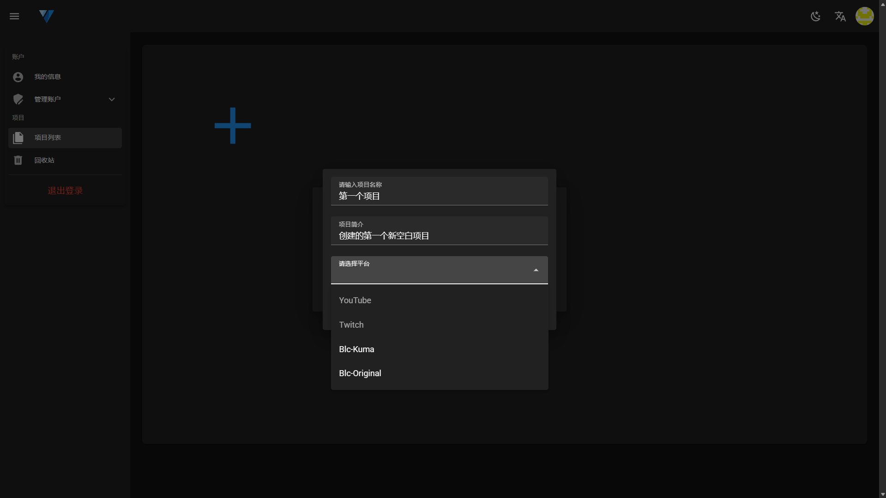

# Create Project

The entry for all projects is located in the <a href="/projects" target="_blank">Project List</a> page in your personal information.

Project is the container for all your style configurations, each project corresponds to a specific live streaming platform and specific chat software. CSSGen provides two ways to create projects, you can choose according to your actual needs:

## Create Methods

Click the ➕ button in the project list to open the create panel.

### 1. Create New Project

Create a new chat style project from scratch.

### 2. Import Template

If you have a configuration template for another project, you can choose to import the template to quickly create a new project.

> ⚠️ **Note**: Import template function is not yet available, please stay tuned for our updates.

## Create New Project Steps

After clicking the create new project button, the new project panel will be opened.

### Fill in Project Information

- **Project Name** (Required)
    - Give your project a short and easy to identify name
    - Length limit: not more than 19 characters
- **Project Description** (Optional)
    - Briefly describe the purpose or features of the project
    - Helps with subsequent management and identification
- **Platform Selection** (Required)
    - Select the live streaming platform and chat software corresponding to the project
    - Different platforms have different DOM structures, and after selection, they cannot be changed

### Platform Support

When creating a new project, you can choose the following platforms:

- **Blc-Original**: BiliBili - BliveChat@Original
- **Blc-Kuma**: BiliBili - BliveChat@KUMA Modified DOM
- **YouTube**: YouTube Web (Not yet open)
- **Twitch**: Twitch Web (Not yet open)

> ⚠️ **Important Tip**: After selecting the platform, it cannot be changed, please select carefully according to your actual usage scenario.

### Confirm Creation

After clicking the confirm button, the project is created successfully and automatically redirects to the editor page.
