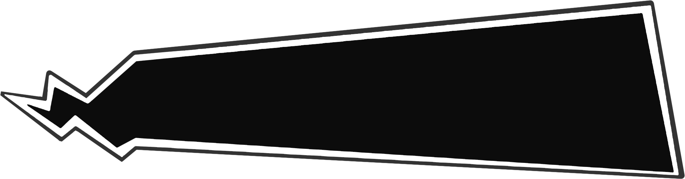

# Edit Message

_After opening the editor for the first time, you will enter a simple process guidance to help you understand the functions and block division of the editor, it is recommended that you complete the process guidance first. You can also refer to [Interface Guide](./page-guide) for more details_

## Type Selection

Let's first select a message type, try the following example.

<!-- demo:message-type-selector -->

After completing the same settings in the editor interface, the preview area will display the corresponding message style.

## Edit Style

Next, let's edit the message style. The setting area contains two modes: normal settings and advanced settings. The normal settings mode includes some global or preset options for you to operate, while the advanced settings mode allows you to set detailed information for each layer.

Let's switch back to the `text message` `overall style` and start editing.

### Normal Settings

#### Hide Timestamp

Similar to the example below, find the `Time` option in the layout adjustment of the normal settings and toggle it off.

<!-- demo:hide-timestamp -->

_You can also try changing more options to get different styles._

#### Edit Text Area

Common styles often set text borders and backgrounds to achieve better readability. Change the option in the normal settings to `Text Content` and start adding some styles.

<!-- demo:text-element -->

Here, you can edit the border style and background color. Let's first understand how the border setting works.

The border setting has normal mode and advanced mode. In the normal mode, you can set line borders, and in the advanced mode, you can add an image as a border to get a rich display effect.

> If you are trying the border setting in the normal mode, note that other options will only take effect after setting the `Style` option.

In the process of designing, the image border is often used, let's switch to the advanced mode and add this image as a border. You can <a href="javascript:void(0)" onclick="navigator.clipboard.writeText('https://s2.loli.net/2022/01/04/RVt9d3EaZXflOCM.png').then(()=>alert('Copied to clipboard')).catch(()=>alert('Failed to copy, please copy manually')); return false;">copy the image link</a> or download the image to your local.

If you have added and selected it, you will find that the style is not that good, because the image border often needs `slice`.

Slice helps the editor understand how you want the border to be divided, because a typical border needs to contain nine regions. You can set it in the `slice` dialog box after clicking the `Slice adjustment` button.

||Nine Region Division||
|-|-|-|
|Top-Left Corner|Top Border|Top-Right Corner|
|Left Border|Middle Region(usually used for content)|Right Border|
|Bottom-Left Corner|Bottom Border|Bottom-Right Corner|

Let's set the left two values to `351` and `100`, and the bottom two values to `406` and `1907`, then click save to confirm.

You will find that the coverage and style of the border have changed significantly. At this point, drag the `scale` slider to a smaller value, and the style will be the best.

The `border style` option below can modify the display mode of the four `borders` in the nine regions, the most commonly used is `stretch`, you can also try changing different modes to see the differences. The `Display inner` checkbox can control whether the content in the middle region of the nine regions is displayed. If checked, the original content of the stretched image will be displayed, otherwise the middle region will be set to transparent.

After completing the settings, you will find that the text display is not that good, let's switch to the advanced mode and try more operations.

### Advanced Settings

The advanced mode is closer to the editing style of traditional drawing software, each element will be regarded as a separate layer. It can be selected and jumped to the corresponding layer by clicking on the element in the preview area.

#### Edit Text Color

In the advanced mode, let's select the corresponding layer of the text content first, its name is `Message box`. Then click the dropdown box, select `Font` and confirm the addition, then you will see the related content in the layer.

> The content added through the dropdown box is called `Style component`, each style component contains one or more style attributes, you can click the name of the style component to expand or collapse the included style attributes.

<!-- demo:font-editor -->

Here you can set various attributes of the text, let's try to modify the color to white first, then confirm the save, you will find that the text is already well displayed on the black background. At the same time, the font setting will affect the display effect of all the text in this layer and the layers it contains. If you have already set the global font style at the outer layer, there is no need to set it for each layer again.

> Note: The font name can be selected from the dropdown box after clicking the `Get local font list` button. If your browser does not support the list fetching, you can also  input the name directly. Note that the actual name and display name of some fonts may not be consistent.

#### Hide Layer

In the `normal settings`, we have set the time display to be hidden, in the advanced settings, we can set the display status of each layer.

Here we want to hide all the user-related information, let's first select the corresponding layer, its name is `Author info`. Click the dropdown box, select `Display` and confirm the addition.

<!-- demo:display-editor -->

Here we set the display mode to `hidden`, you will find that the user information is no longer displayed.

> Some chat software may contain layers that cannot be directly adjusted, you can check the `Force apply` option to ensure the modification takes effect. This option exists in each style component.

## Complete Editing

You have completed a simple style. You can return to the previous steps to change more options to try the functions of the editor, or go to [component guide](./component-guide) to learn how to use each component.

Next, let's learn how to manage styles and export them for use.