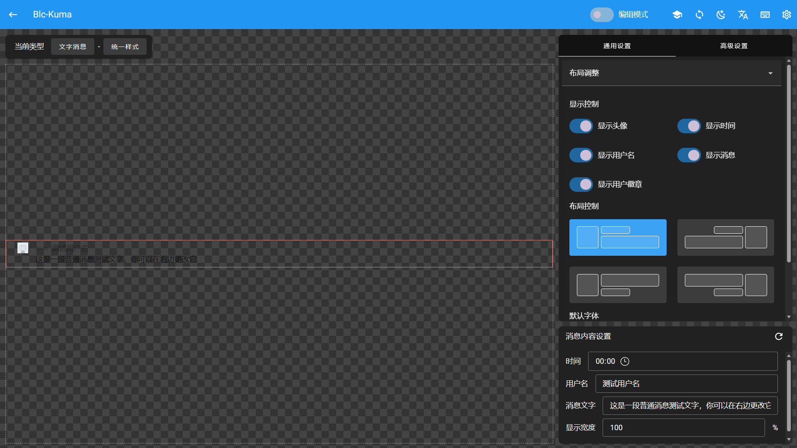

# Editor Introduction

_After opening the editor for the first time, you will enter a simple guide to help you understand the editor's functionality and region division. It is recommended to complete the guide first._

The interface is mainly divided into three regions:

- **System settings area**: The upper right corner of the page for system settings and project data management
- **Preview area**: The left side of the page for real-time preview of the current style
- **Edit area**: The right side of the page for style editing

The content of the preview and edit areas will differ depending on the mode you select.

## System settings area

You can manage project data or perform system settings here.

### Tutorial replay

Tutorial replay restarts the guide tutorial; when the interface content is updated, a hint will also be shown.

### Sync configuration

Sync configuration decides the sync strategy based on cloud and local data state. If your local data is newer than the cloud, your data will be uploaded to the cloud automatically. If your cloud data is newer, a dialog will help you decide whether to overwrite the cloud data or sync the cloud data to local.

> Sync configuration may overwrite your local settings. If you are concerned about data loss, you can export a JSON backup first.

### Theme switch

Theme switch changes the editor's theme color and supports light and dark modes.

### Language switch

Language switch changes the editor's interface language.

### Image management

Image management opens the image management dialog, where you can manage images within the project.

### Project settings

Project settings expands the project-related operation list, where you can manage project data.

### Shortcut settings

Shortcut settings help you customize shortcuts to improve editing efficiency. Configuration is saved locally only; you need to set it again after switching devices.

- **Local save**: Enabled by default. Press `Ctrl + S` to save project data to local cache.

> Note: If you have not saved the project to local or cloud, data will be lost after closing the project.

- **Undo**: Enabled by default. Press `Ctrl + Z` to undo the last operation.

- **Redo**: Enabled by default. Press `Ctrl + Shift + Z` to redo the last undone operation.

> Undo and redo can record at most 40 operations.

- **Cloud sync**: Disabled by default. Press `Ctrl + Alt + S` to trigger sync configuration check, same as the button.

> Some shortcuts such as `Ctrl + W` are occupied by your browser's default behavior (e.g. close tab). Note that such key combinations cannot be set; if you need to use them, change your browser shortcuts first.

### Insert global CSS

This option opens the global CSS insertion dialog. If you are familiar with CSS and want to use more advanced properties or syntax, you can insert them here. Inserted CSS is not managed by the editor but takes effect as global styles.

### Import...

Import includes import config and import local CSS; you can choose what to import here.

> CSS import cannot fully map all operations to the editor. Some unsupported properties will be applied in global CSS, and some will be inserted into the layer as `custom code` components.

### Export...

Export includes export config, export local CSS, and export online CSS link; you can choose what to export here.

### Mode switch

The style editor provides two modes: Edit mode and Smart mode. The preview and edit area content differs between modes, and you can switch at any time.

- **Edit mode**: Provides rich style editing. In this mode you can adjust all available properties and details in full. <a href="./editor-mode">Learn more</a>

- **Smart mode**: Edit mode with AI assistant. You can give instructions to the AI assistant to adjust styles quickly. <a href="./agent-mode">Learn more</a>

> Smart mode is still under development. If you have any issues or suggestions, please feel free to contact us.
