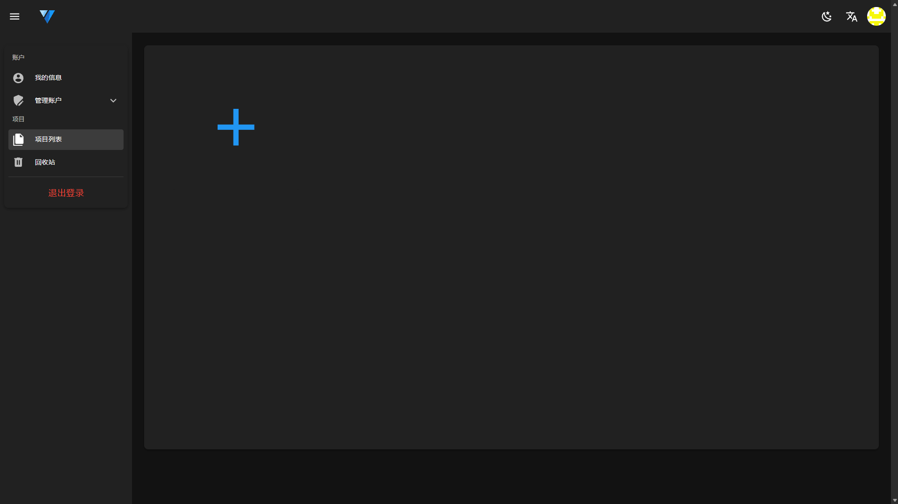
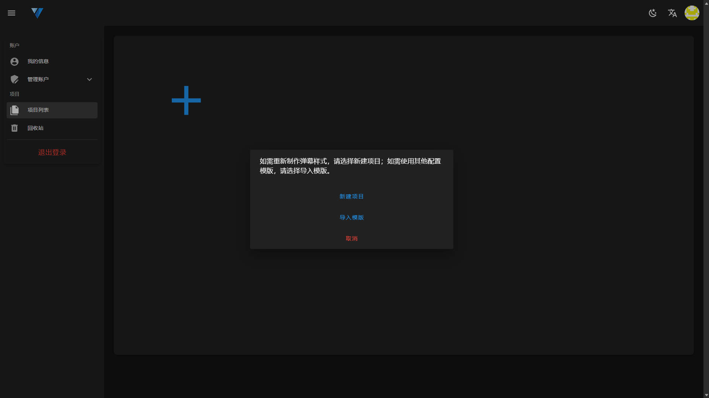

# 创建项目

所有项目的入口位于您个人信息的<a href="/projects" target="_blank">项目列表</a>页面内。

项目是您所有样式配置的容器，每个项目都对应一个特定直播平台的特定弹幕软件。CSSGen 提供了两种创建项目的方式，您可以根据实际需求选择：

## 创建方式

点击项目列表中的 ➕ 按钮打开创建面板。

### 1. 新建项目

从头开始创建全新的弹幕样式项目。

### 2. 导入模板

如果您已有其他项目的配置模板，可以选择导入模板来快速创建新项目。

> ⚠️ **注意**：导入模板功能暂未开放，敬请期待。

## 新建项目步骤

选择新建项目按钮后，打开新建项目面板。

### 填写项目信息

- **项目名称**（必填）
    - 为您的项目起一个易于识别的简称
    - 长度限制：不超过 19 个字符
- **项目描述**（可选）
    - 简要描述项目的用途或特点
    - 有助于后续管理和识别
- **平台选择**（必选）
    - 选择项目对应的直播平台和弹幕软件
    - 不同平台的 DOM 结构不同，选择后无法更改

### 平台支持

新建项目时，您可以选择以下平台：

- **Blc-Original**: BiliBili - BliveChat@原版
- **Blc-Kuma**: BiliBili - BliveChat@KUMA修改版DOM
- **YouTube**: YouTube Web（暂未开放）
- **Twitch**: Twitch Web（暂未开放）

> ⚠️ **重要提示**：平台选择后无法更改，请根据您的实际使用场景谨慎选择。

### 确认创建

点击确认按钮后，项目创建成功并自动跳转到编辑器页面。
