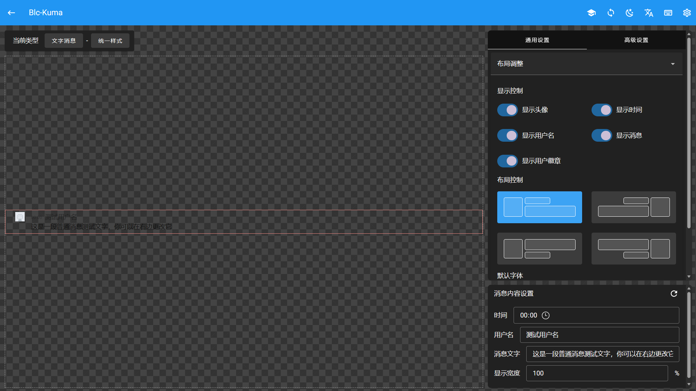
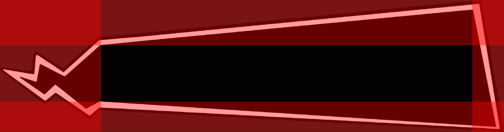

# 编辑消息

_初次打开编辑器后，您会进入一个简单的流程指引来帮助您了解编辑器的功能和区块划分，建议您先完成流程指引。您也可以查看[界面指南](./page-guide)了解更多细节_

## 类型选择

让我们先选择一个消息类型，试试下面的示例。

<!-- demo:message-type-selector -->

在编辑器界面完成相同的设置后，预览区域将会显示对应的消息样式。

## 编辑样式

接下来让我们编辑消息样式，设置区域包含通用设置和高级设置两种模式，通用设置模式下包含了一些全局的或预设的选项供您操作；而在高级设置模式下，您可以针对单个图层进行更详细的设置。

首先让我们切换回 `文字消息` 的 `统一样式` 以方便我们进行编辑。

### 通用设置

#### 隐藏时间显示

类似下面的示例，在通用设置的布局调整中找到 `显示时间` 选项，并将其关闭。

<!-- demo:hide-timestamp -->

_您也可以尝试更改更多的选项来获得不同的效果。_

#### 编辑文字区域

比较常见的样式都会设置文字边框和背景以获得较好的阅读对比度，将通用设置的选项更改为 `内容信息` ，接下来我们开始添加一些样式。

<!-- demo:text-element -->

在这里，您可以编辑边框样式和背景颜色，让我们先了解一下边框设置的工作方式。

边框设置分为普通模式和高级模式，普通模式下您可以设置基础的线条边框，高级模式下则可以添加图片作为边框以获得更加丰富的显示效果。

> 如果您正在尝试普通模式，请注意只有在设置 `样式` 选项后其他选项才会生效。

实际样式的设计过程中，图片边框的使用往往较多，让我们先切换到高级模式并添加上面这一张图片作为边框，你可以<a href="javascript:void(0)" onclick="navigator.clipboard.writeText('https://s2.loli.net/2022/01/04/RVt9d3EaZXflOCM.png').then(()=>alert('已复制到剪贴板')).catch(()=>alert('复制失败，请手动复制')); return false;">复制图床链接</a>或将图片下载至本地。

如果您完成了添加并选中，会发现直接显示的效果并不好，这是因为图片边框往往需要进行 `裁切`。

裁切能够帮助编辑器理解您希望边框以怎样的形式被分割，因为一个典型的边框需要包含九个区域，也就是我们常说的 `九宫格`。您可以在 `调整裁切` 弹出的对话框中进行设置。

||九宫格划分||
|-|-|-|
|边框左上角|上边框|边框右上角|
|左边框|中间区域(一般用以显示内容)|右边框|
|边框左下角|下边框|边框右下角|

其中四个角的大小是固定不变的，而四边和内部的内容可以根据需要进行设置。让我们先把左侧的两个值设为 `351` 和 `100` ，下方的值设置为 `406` 和 `1907` ，然后点击保存确认。

您会发现边框的覆盖范围和显示效果都发生了明显的变化，这时候再拖动 `缩放` 滑块到一个较小的值，边框的显示效果将变为最佳。

最下面的边框样式可以修改九宫格中四个 `边框` 的显示模式，一般最为常用的是 `拉伸`，您也可以尝试更改不同的模式来查看他们的区别。内部显示勾选框可以控制九宫格中中间区域的内容是否显示，勾选后将显示拉伸后的图片原始内容，取消勾选则会将中间区域设置为透明。

完成设置后，您会发现文字显示效果不太好，让我们切换到高级模式并尝试更多操作。

### 高级设置

高级模式更接近传统绘图软件的编辑方式，每个元素都将被视为一个单独的图层，并且能够通过在预览区域点击元素来选中并跳转到对应图层。

#### 编辑文字颜色

在高级模式的选项卡下，让我们先选中文字内容的对应图层，他的名称是 `消息` 。然后点击下拉框，选择 `文字基本设置` 并确认添加，随后您将看到图层中出现了相关内容。

<!-- demo:font-editor -->

这里您可以对文字的多种基础属性进行设置，让我们先尝试修改文字颜色为白色，并确认保存，您会发现文字已经能很好的显示在黑色背景上了。同时，字体设置会影响本图层以及它所包含子图层的所有文字显示效果，如果您在最外层已经设置了全局字体样式，就不需要再对每个图层进行额外设置了。

> 注意：字体名称可以在点击获取本地字体列表后进行下拉框选择，如果您的浏览器不支持获取字体列表也可以直接输入名称。需要注意一些字体的实际名称和显示名称可能并不一致。

#### 隐藏图层

在 `通用设置` 中，我们设置了隐藏时间显示，而在高级设置下，我们可以设置每个图层的显示状态。

这里我们希望能隐藏用户相关的所有信息，让我们先选中对应的图层，它的名称是 `用户信息` 。然后点击下拉框，选择 `显示与排版` 并确认添加。

<!-- demo:display-editor -->

这里我们将显示方式设置为 `隐藏` ，您会发现用户信息已经不再显示了。

> 一些平台的弹幕软件可能包含无法直接调整的图层显示设置，这时您可以勾选强制应用来保证修改能够生效，强制应用选项在每种属性设置中都存在。

## 完成编辑

现在您已经完成了一个简单的样式编辑，您也可以返回之前的步骤更改更多的选项以尝试编辑器的功能，也可以前往[组件指南](./component-guide)了解每个组件的使用方法。

接下来让我们了解一下如何管理样式并将其导出使用。