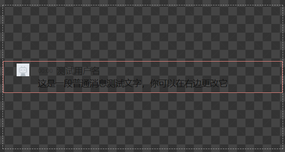
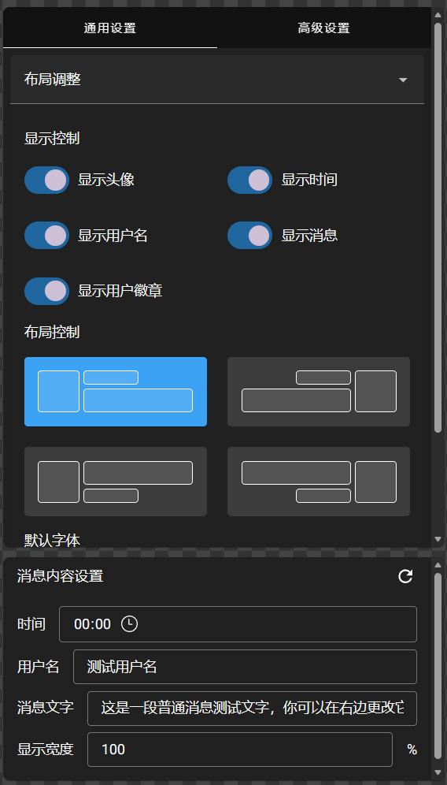

# 编辑器简介

_初次打开编辑器后，您会进入一个简单的流程指引来帮助您了解编辑器的功能和区块划分，建议您先完成流程指引。_

## 区块划分

_您可以随时前往编辑器页面的对应区块进行操作。_

### 类型选择

用于选择消息的类型，您可以在此选择要调整的消息，试试下面的示例。

<!-- demo:message-type-selector -->

### 预览区域

在类型选择区域下方为当前选中类型的消息样式预览。在高级设置模式下，你也可以通过点击预览内容来选中对应的图层。

### 编辑区域

界面的右侧为编辑区域，您可以在此进行样式编辑，编辑区域中的内容会根据您选择的消息类型和属性进行实时更新。您也可以更改消息内容设置中的选项来测试不同情况下消息的显示效果。

_消息内容设置中的内容不会保存到配置中，每次进入编辑器都会重置。_

### 系统设置

右上角为系统设置区域，您可以在此进行：

- 教程重放
- 云同步
- 主题切换
- 语言切换
- 快捷键设置
- 项目设置